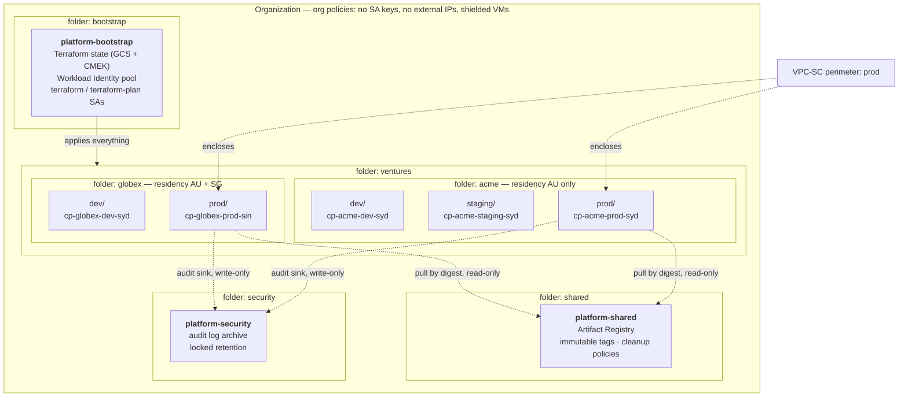
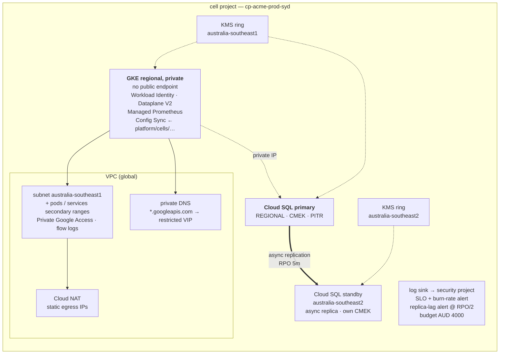

# gcp-cell-platform

Terraform for **cell-based GCP infrastructure**: every cell is an isolated GCP
project with its own network, GKE cluster, database, encryption keys, security
perimeter, observability and budget. Cells are grouped under *ventures*
(product lines) and promoted through dev → staging → production.

Two ventures and five cells are defined here, spanning Sydney, Melbourne,
Singapore and Jakarta, with two different data-residency envelopes — enough to
prove the pattern generalises without turning the repository into something
nobody has time to read.

> **Status.** This is a reference implementation, not a running system. Every
> module and stack passes `terraform fmt`, `terraform validate`, `tflint` and
> `checkov`, and the cell registry and policy gates run green in CI — all
> without cloud credentials. It has **not** been applied end to end against a
> live GCP organization, and nothing below claims otherwise. Where a control
> could not be exercised (Assured Workloads), it is implemented behind a flag
> and the reason is written down rather than glossed over.

---

## The whole interface is one file

Adding a cell means adding a YAML file. Nothing else.

```yaml
# ventures/acme/cells/prod-syd.yaml
venture: acme
cell:    prod-syd
env:     prod
region:  australia-southeast1        # Sydney

dr:
  standby_region: australia-southeast2 # Melbourne
  rpo_minutes: 5
  rto_minutes: 30

gke:
  private_endpoint: true
  node_pools:
    - { name: general, machine_type: n2d-standard-4, min_nodes: 3, max_nodes: 12 }
  quotas: { cpu: "40", memory: 160Gi, pods: "500" }

database:
  tier: db-custom-2-8192
  availability: REGIONAL

security:
  cmek: true
  vpc_service_perimeter: true

budget:
  monthly_aud: 4000
```

```console
$ make plan CELL=acme/prod-syd
```

That produces a whole environment: project, VPC with private Google access and
Cloud NAT, private regional GKE cluster with Workload Identity, PostgreSQL with
a synchronous in-region standby *and* an asynchronous Melbourne replica, two
regional KMS key rings, audit log export to a separate security project, an
availability SLO with burn-rate alerting, and a budget.

The numbers in the contract are load-bearing. `rpo_minutes: 5` is not
documentation — it sets the threshold of the replica-lag alert (at half the RPO)
and it is what `make drill` measures against.

---

## Architecture



Inside a single cell:



The cross-region arrow is the one worth staring at. GCP VPCs are global, so the
Melbourne replica attaches to the *same* VPC and the *same* Private Service
Access allocation — no peering, no second network. But KMS key rings are
regional, so it needs its *own* key. Getting that wrong is the most common way a
cross-region replica fails to create.

---

## How this maps to the role

| Requirement | Where it lives |
|---|---|
| Cell-based GCP infra, each cell an isolated project | [`modules/cell/`](modules/cell/main.tf) composes project + network + GKE + database + KMS + observability + budget. One root module, [`stacks/cell/`](stacks/cell/main.tf), instantiated per cell via backend prefix — [ADR 0002](docs/adr/0002-single-root-module-per-cell.md) |
| CI/CD across ventures and cells, dev → staging → prod | [`validate.yml`](.github/workflows/validate.yml) (credential-free, every PR) · [`plan.yml`](.github/workflows/plan.yml) (only the affected cells) · [`promote.yml`](.github/workflows/promote.yml) (GitHub Environment approval gates + soak) · [`drift.yml`](.github/workflows/drift.yml) |
| GKE: node pools, autoscaling, quotas, network policy, workload identity | [`modules/gke/`](modules/gke/main.tf) — private regional cluster, per-pool autoscaling with surge upgrades, Dataplane V2, `GKE_METADATA`. Quotas and default-deny NetworkPolicy are rendered from the contract into [`platform/cells/`](platform/cells/) and delivered by Config Sync — [ADR 0006](docs/adr/0006-config-sync-over-kubernetes-provider.md) |
| Observability: logging, metrics, tracing, alerting, runbooks | [`modules/observability/`](modules/observability/main.tf) — audit sink to a project the cell cannot touch, Managed Prometheus, an availability SLO with 14.4× fast-burn alerting, and an alert on any privileged human action. Runbooks in [`docs/runbooks/`](docs/runbooks/) |
| IAM, VPC-SC, private networking, Cloud KMS/CMEK, Assured Workloads, zero trust | Groups-only IAM with time-bound break-glass ([`modules/project`](modules/project/main.tf)) · perimeter + device-aware access level ([`stacks/org`](stacks/org/main.tf)) · restricted-VIP DNS ([`modules/network`](modules/network/main.tf)) · per-region CMEK with service-agent grants ([`modules/kms`](modules/kms/main.tf)) · Assured Workloads — [ADR 0007](docs/adr/0007-assured-workloads-deferred.md) |
| DR: cross-region replication, tested failover, RPO/RTO | [`modules/database`](modules/database/main.tf) Sydney → Melbourne · [`scripts/dr_drill.sh`](scripts/dr_drill.sh) measures the posture read-only against the contract's targets · [`docs/runbooks/failover.md`](docs/runbooks/failover.md) |
| Automate: drift, policy audit, secret rotation, certs, cost | Nightly drift with self-closing issues · [`policy/cell.rego`](policy/cell.rego) + [`scripts/validate_cells.py`](scripts/validate_cells.py) · Secret Manager rotation schedule + Pub/Sub · [`modules/budget`](modules/budget/main.tf) with forecast alerting and registry cleanup policies |

---

## Layout

```
ventures/           the cell registry — YAML contracts, the only thing that changes day to day
  acme/venture.yaml     residency envelope, owning groups, cost centre
  acme/cells/*.yaml     one file per cell
modules/
  cell/             the composite: everything a cell is
  project/ network/ gke/ database/ kms/ observability/ budget/
stacks/
  bootstrap/        state bucket + Workload Identity pool (applied once, with local state)
  org/              folders, org policies, VPC-SC, audit archive, shared registry
  cell/             ONE root module, instantiated per cell
platform/cells/     generated Kubernetes baseline, delivered by Config Sync
policy/             conftest rules + a fixture proving they reject
scripts/            contract validation, manifest rendering, DR drill
docs/adr/           why things are the way they are
docs/runbooks/      what to do at 3am
```

## Running the checks

Everything CI runs, with no cloud credentials and no GCP organization:

```console
$ make check
  modules/budget               Success! The configuration is valid.
  modules/cell                 Success! The configuration is valid.
  …
✓ 5 cell(s) across 2 venture(s): schema, residency, addressing and naming all valid
✓ platform manifests match the cell contracts
✓ policy correctly rejects the non-compliant fixture

✓ all offline checks passed
```

`make check` needs Terraform, Python with PyYAML, and conftest. `make lint`
additionally needs tflint.

Against a real organization:

```console
$ make plan  CELL=acme/prod-syd
$ make apply CELL=acme/prod-syd
$ make drill CELL=acme/prod-syd     # read-only; safe against prod
```

## Design decisions

| | |
|---|---|
| [0001](docs/adr/0001-cell-as-project.md) | The cell is a project, not a namespace |
| [0002](docs/adr/0002-single-root-module-per-cell.md) | One root module for every cell |
| [0003](docs/adr/0003-cidr-registry.md) | Non-overlapping CIDRs, enforced in CI |
| [0004](docs/adr/0004-gke-standard-over-autopilot.md) | GKE Standard over Autopilot |
| [0005](docs/adr/0005-private-control-plane.md) | No public control plane, no bastion |
| [0006](docs/adr/0006-config-sync-over-kubernetes-provider.md) | Config Sync, not the Terraform Kubernetes provider |
| [0007](docs/adr/0007-assured-workloads-deferred.md) | Org policy now, Assured Workloads behind a flag |
| [0008](docs/adr/0008-manual-cross-region-promotion.md) | Cross-region promotion is manual |

## What is deliberately not here

Being explicit about the edges is more useful than pretending there are none.

- **Application delivery.** This repository provisions cells and the Kubernetes
  baseline. What runs inside them is another repository's job; the boundary is
  Config Sync's `policy_dir`.
- **Binary Authorization.** The registry enforces immutable tags and scans on
  push, but admission-time signature verification is not wired up — see
  [ADR 0008](docs/adr/0008-manual-cross-region-promotion.md) for the related
  promotion reasoning and the note on what closing this gap requires.
- **Multi-cell traffic management.** Cells are independent by design. A global
  load balancer steering traffic across cells is a real need as a venture grows,
  and it is not modelled here.
- **Assured Workloads.** Implemented, defaulted off, reasoned about in
  [ADR 0007](docs/adr/0007-assured-workloads-deferred.md).
