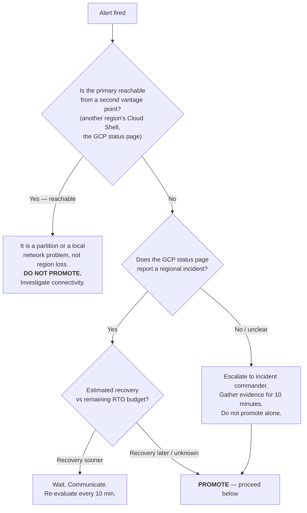

# Runbook — regional failover (Sydney → Melbourne)

**Applies to:** any cell whose contract declares `dr.standby_region`.
**Audience:** the on-call platform engineer. No prior context assumed.
**Read this before you need it.** The drill (`make drill CELL=…`) is safe to run
against production and takes about a minute.

---

## Objectives

Read from the cell contract; these are the numbers the alerting is calibrated
to, not aspirations.

| Cell | RPO | RTO | Primary | Standby |
|---|---|---|---|---|
| `acme/prod-syd` | 5 min | 30 min | australia-southeast1 | australia-southeast2 |
| `acme/staging-syd` | 15 min | 60 min | australia-southeast1 | australia-southeast2 |
| `globex/prod-sin` | 5 min | 30 min | asia-southeast1 | asia-southeast2 |
| `acme/dev-syd`, `globex/dev-syd` | — | — | no standby; accepted risk |

What each layer covers:

| Failure | Covered by | Human involved? | RPO |
|---|---|---|---|
| Single node / pod | GKE autoscaler, 3-node floor | no | 0 |
| Zone loss | regional cluster + `availability_type = REGIONAL` | no | 0 |
| **Region loss** | **cross-region replica — this runbook** | **yes** | ≤ RPO |
| Bad migration / data corruption | point-in-time recovery — *not this runbook* | yes | to the second |

> Cross-region replication does **not** protect you from a bad migration. The
> replica reproduces the damage faithfully. If the problem is corrupt data, stop
> reading and go to [Recovering from corruption](#recovering-from-corruption).

---

## Decide

The expensive mistake is promoting during a partition. Work through this before
touching anything.



Two people minimum for a prod promotion: one executes, one verifies. Say out
loud to each other that you are promoting and why.

---

## Promote

Set your context:

```bash
CELL=acme/prod-syd
VENTURE=${CELL%%/*}; NAME=${CELL##*/}
PROJECT=cp-$VENTURE-$NAME
INSTANCE=$VENTURE-$NAME
REPLICA=$INSTANCE-standby
```

### 1. Record where you are starting from (30 s)

Do this even though you are in a hurry. Post-incident review needs it, and so
will you in twenty minutes.

```bash
gcloud sql instances describe "$REPLICA" --project "$PROJECT" \
  --format='yaml(state,region,replicaConfiguration,masterInstanceName)'
```

Capture the current replica lag from the alert that fired. **That number is your
actual data loss.** Write it in the incident channel now.

### 2. Stop the writers (2 min)

Promoting while the application can still reach a recovering primary is how you
get two writers. Scale the writers down first.

```bash
gcloud container clusters get-credentials "$INSTANCE" \
  --region "$(yq -r .region ventures/$VENTURE/cells/$NAME.yaml)" --project "$PROJECT"

kubectl -n app scale deployment --all --replicas=0
kubectl -n app get pods -w   # wait until empty
```

If the cluster is unreachable because the region is gone, the writers are
already stopped. Move on.

### 3. Promote (2–5 min)

```bash
gcloud sql instances promote-replica "$REPLICA" --project "$PROJECT"
```

**This is irreversible.** The replication relationship is destroyed; `$REPLICA`
becomes a standalone primary. Recreating the original topology later means
seeding a fresh replica, which takes hours for a real dataset.

Watch for `RUNNABLE`:

```bash
watch -n 10 "gcloud sql instances describe $REPLICA --project $PROJECT --format='value(state)'"
```

### 4. Repoint the application (5 min)

The connection endpoint changes. It is read from Secret Manager, so update the
secret rather than editing manifests.

```bash
NEW_IP=$(gcloud sql instances describe "$REPLICA" --project "$PROJECT" \
  --format='value(ipAddresses[0].ipAddress)')

printf '%s' "$NEW_IP" | gcloud secrets versions add "${INSTANCE}-db-host" \
  --project "$PROJECT" --data-file=-

kubectl -n app rollout restart deployment
kubectl -n app scale deployment --all --replicas=3
```

### 5. Verify (5 min)

```bash
kubectl -n app get pods
curl -sS -o /dev/null -w '%{http_code}\n' "https://$(yq -r .observability.uptime_check_host ventures/$VENTURE/cells/$NAME.yaml)/healthz"
```

Confirm in Cloud Monitoring that the uptime check is passing and the error
budget has stopped burning.

### 6. Reconcile Terraform (do not skip)

State now disagrees with reality: Terraform believes `$REPLICA` is a replica of
`$INSTANCE`. The next apply — or the nightly drift job — will try to "fix" that.

1. Open an incident PR that updates the cell contract: swap `region` and
   `dr.standby_region`.
2. `terraform state rm` the old primary and the replica, then import the
   promoted instance as the primary.
3. Apply, and confirm a clean plan before closing the incident.

Until this is done, **pin the drift job** for this cell so it does not raise
noise on a known divergence.

---

## Recovering from corruption

Different failure, different tool. Do **not** promote.

```bash
# Rewind to a point before the damage. Restores into a NEW instance —
# the original is left untouched.
gcloud sql instances clone "$INSTANCE" "${INSTANCE}-pitr-$(date +%s)" \
  --project "$PROJECT" \
  --point-in-time "2026-08-12T04:30:00Z"
```

Verify the clone contains what you expect *before* repointing anything. PITR
reaches back `transaction_log_retention_days` (7 in prod, 1 in dev).

---

## Replica lag

The alert `[cell] Cross-region replica lag exceeds RPO budget` means the
declared RPO is not currently achievable. It is not an outage.

Usual causes, in order of likelihood:

1. **A bulk write on the primary** — a migration, a backfill, a large delete.
   Lag recovers on its own. Confirm the write is finite and wait.
2. **The replica is undersized.** Check `standby_tier` in the contract. A
   replica smaller than the primary cannot keep up with the primary's write
   rate, and that is a contract change, not an incident fix.
3. **Long-running query on the replica** blocking replay. Find it in Query
   Insights and terminate it.
4. **Cross-region network degradation.** Rare. Check the status page.

If lag stays above budget for more than an hour, either fix the cause or amend
`rpo_minutes` in the contract to a number that is true. An objective you are
knowingly missing is worse than a weaker objective you meet.

---

## Drill log

`make drill CELL=…` is read-only and safe against production. Run it monthly per
prod cell and after any change to the database module. Record results here.

| Date | Cell | Result | Lag observed | Notes |
|---|---|---|---|---|
| _(none yet — this repository has not been applied to a live organization)_ | | | | |

A full promotion drill — actually promoting in a dev or staging cell and
measuring wall-clock RTO — should be run quarterly. The read-only drill verifies
the *preconditions*; only a real promotion verifies the *procedure*.
